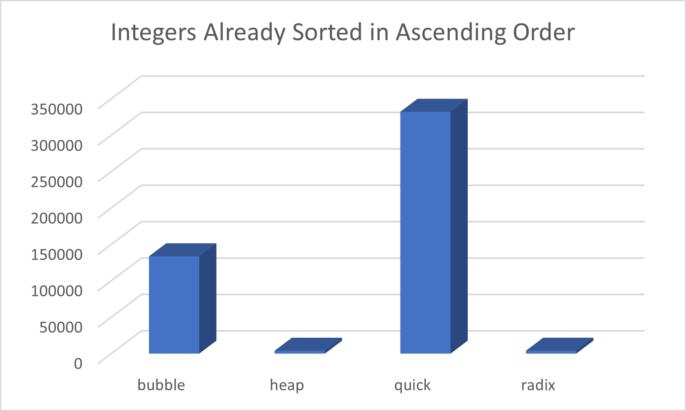

## Sorting Experiment
### Taylor Mendez 
### Description:

This is the experiment to compare the sorting routines
we discussed in class. This particular experiment was
for integers up to the maximum value of 1073741824.

The following was varied for each case:
- discombulation of data:
    - random
    - reverse sorted
    - already sorted

### Results
#### Random

### Files

|   #   | File                                   | Description                                                |
| :---: | --------------------------             | ---------------------------------------------------------- |
|   0   | [driver.cpp](./main.cpp)               | Driver Code                                                |
|   1   | [bubble sort](./bubbleSort.hpp)        | bubble sort                                                |
|   2   | [heap sort](./heapSort.hpp)            | heap sort                                                  |
|   3   | [quick sort](./quickSort.hpp)          | quick sort                                                 |
|   4   | [radix sort](./radixSort.hpp)          | radix sort                                                 |
|   5   | [rnums](./rnums.dat)                   | data set of integers                                       |
|   6   | [rnumsascending](./rnumsascending.dat) | data set of integers sorted in ascending order             |
|   7   | [rnumsdescending](./rnumsdescending)   | data set of integers sorted in descending order            |
|   8   | [geNums](./geNums.py)                  | python program to generate random numbers                  |

### Instructions

- This project was compiled using C++ 11

### Sources
- https://www.programiz.com/dsa/quick-sort
- https://www.programiz.com/dsa/radix-sort
- https://www.programiz.com/dsa/heap-sort
- https://www.geeksforgeeks.org/bubble-sort/
