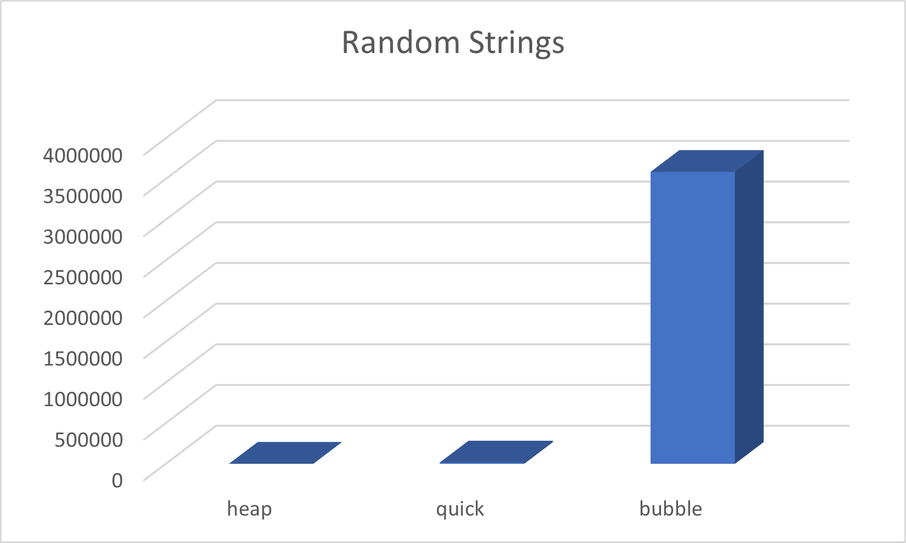
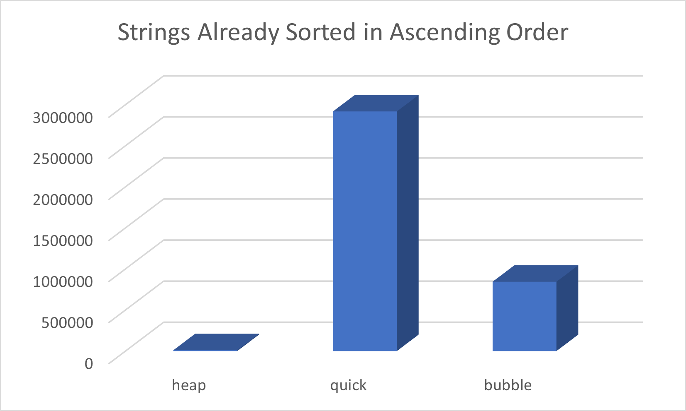

## Sorting Experiment
### Taylor Mendez 
### Description:

This is the experiment to compare the sorting routines
we discussed in class. This particular experiment was
for string with the maximum length of 10 characters. I
did not include radix sort in this experiment because 
radix sort is intended to effeciently sort large numbers.

The following was varied for each case:
- discombulation of data:
    - random
    - reverse sorted
    - already sorted

### Results
#### Random

#### Ascending

#### Descending

### Files

|   #   | File                                       | Description                                         |
| :---: | ------------------------------------------ | --------------------------------------------------- |
|   0   | [driver.cpp](./main.cpp)                   | Driver Code                                         |
|   1   | [bubble sort](./bubbleSort.hpp)            | bubble sort                                         |
|   2   | [heap sort](./heapSort.hpp)                | heap sort                                           |
|   3   | [quick sort](./quickSort.hpp)              | quick sort                                          |
|   5   | [rwords](./rwords.dat)                     | data set of strings                                 |
|   6   | [rwordsascending](./rwordsascending.dat)   | data set of strings sorted in ascending order       |
|   7   | [rwordsdescending](./rwordsdescending.dat) | data set of strings sorted in descending order      |

### Instructions

- This project was compiled using C++ 11

### Sources
- https://www.programiz.com/dsa/quick-sort
- https://www.programiz.com/dsa/heap-sort
- https://www.geeksforgeeks.org/bubble-sort/
